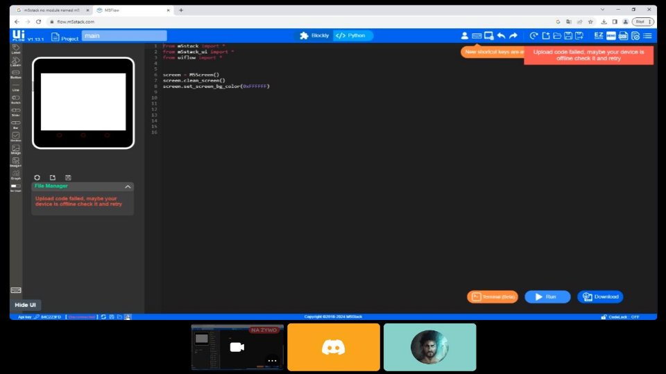

**Przebieg ciśnienia z soboty 03.02.2024 od godziny 14 do północy**

**Przebieg jasności z soboty 03.02.2024 od godziny 14 do północy**

**Korelacja + wartości oczekiwane:**

Średnia jasność: 36.451432734337054 

Średnie ciśnienie 100364.69492472075 

Korelacja między ciśnieniem a jasnością: -0.9096551683040444

 

**Ale na szczęście znaleźliśmy pewne obejście korzystając z EC2** ☺

**Pierwotna wersja repozytorium**

